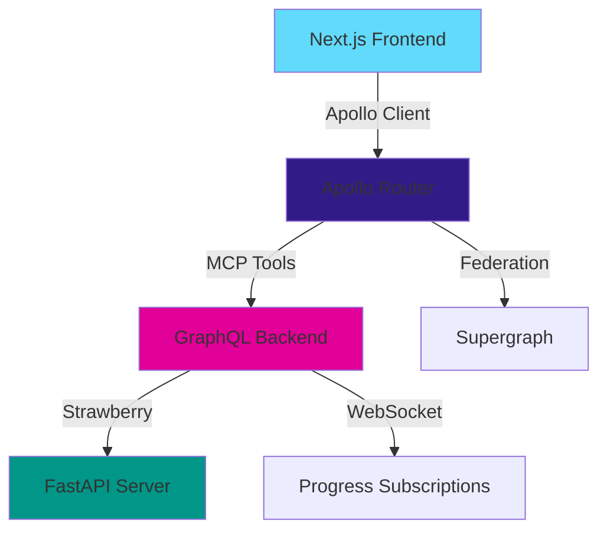

# 🎯 Tesseract Voice AI - MCP+GraphQL Control Plane

A **tight end-to-end integration** of Model Context Protocol (MCP) with GraphQL, creating a powerful control plane for test orchestration and code generation with built-in dry-run support and real-time progress tracking.

## 🚀 **What Makes This Special**

This implementation provides the **first complete MCP+GraphQL bridge** that transforms GraphQL operations into MCP tools while maintaining full type safety and real-time capabilities.

### ✨ **Key Innovations**
- **🔄 DRY_RUN by Default**: All operations preview before execution
- **⚡ Real-time Progress**: WebSocket subscriptions for live updates  
- **🛡️ Safe Apply**: Interactive confirmation before changes
- **🎛️ MCP Tool Exposure**: GraphQL operations as callable MCP tools
- **🔧 Complete Stack**: Backend → Router → Frontend integration

## 🏗️ **Architecture Overview**



### 🧩 **Components**

#### 1. **Backend GraphQL Server** (`/backend/graphql/`)
- **Strawberry GraphQL** with FastAPI
- **Operations**: `runTests`, `scaffoldPage`, `applyChanges`
- **Subscriptions**: Real-time progress via WebSocket
- **Type Safety**: Complete TypeScript definitions

#### 2. **Apollo MCP Wrapper** (`/apollo-mcp/`)
- **supergraph.yaml**: Federation configuration
- **router.yaml**: MCP tool exposure with parameter validation
- **Rate limiting**, caching, and telemetry built-in

#### 3. **Next.js Frontend** (`/frontend/`)
- **RunTestsPanel**: Interactive control component
- **Apollo Client**: Full subscription support
- **Real-time UI**: Progress bars and live updates

## 🎮 **Core Operations**

### 🧪 **runTests**
Execute test suites with intelligent dry-run workflow:
```graphql
mutation RunTests($suite: String!, $dryRun: Boolean!) {
  runTests(suite: $suite, dryRun: $dryRun) {
    id status startTime results { name status }
  }
}
```

### 🏗️ **scaffoldPage** 
Generate components from templates with preview:
```graphql
mutation ScaffoldPage($template: String!, $name: String!, $path: String!) {
  scaffoldPage(template: $template, name: $name, path: $path, dryRun: true) {
    id preview files { path action content }
  }
}
```

### 📊 **runProgress**
Subscribe to real-time execution updates:
```graphql
subscription RunProgress($runId: String!) {
  runProgress(runId: $runId) {
    progress message type timestamp
  }
}
```

### ✅ **applyChanges**
Confirm and execute after dry-run review:
```graphql
mutation ApplyChanges($runId: String!, $confirmation: ConfirmationInput!) {
  applyChanges(runId: $runId, confirmation: $confirmation) {
    success message appliedChanges { path action }
  }
}
```

## 🚀 **Quick Start**

### **Prerequisites**
- Python 3.9+ with pip
- Node.js 18+ with npm  
- Apollo Router CLI

### **🏃‍♂️ 5-Minute Setup**

**1. Clone and Navigate**
```bash
git clone https://github.com/jmanhype/tesseract-voice-ai.git
cd tesseract-voice-ai
```

**2. Start Backend (Terminal 1)**
```bash
cd backend/graphql
pip install -r requirements.txt
python server.py
# ✅ GraphQL server running at http://localhost:4000
```

**3. Start Apollo Router (Terminal 2)**
```bash
cd apollo-mcp
npm install && npm run setup
npm start
# ✅ MCP Router running at http://localhost:4001
```

**4. Start Frontend (Terminal 3)**
```bash
cd frontend
npm install
npm run dev
# ✅ Next.js app running at http://localhost:3000
```

**5. Test Integration**
```bash
./tests/integration/test-mcp-graphql.sh
# ✅ Full stack integration test
```

### **🐳 Docker Quickstart**
```bash
docker-compose -f docker-compose-integrated.yml up
# All services start automatically
```

## 🎛️ **Usage Examples**

### **Interactive Test Runner**
Visit http://localhost:3000 to see the control panel:
- Select test suite (unit/integration/e2e)
- Toggle dry-run mode (defaults to ON)
- Watch real-time progress
- Confirm execution after preview

### **MCP Tool Integration**
The GraphQL operations are exposed as MCP tools:
```yaml
# Available MCP Tools:
- RunTests: Execute test suites with dry-run
- ScaffoldPage: Generate components with preview  
- RunProgress: Monitor execution progress
- ApplyChanges: Confirm and apply changes
```

### **API Endpoints**
- **GraphQL Playground**: http://localhost:4001/graphql
- **Health Check**: http://localhost:4000/health
- **WebSocket**: ws://localhost:4001/graphql/ws
- **Metrics**: http://localhost:4001/metrics

## 📁 **Project Structure**

```
tesseract-voice-ai/
├── 🔧 backend/graphql/          # Strawberry GraphQL Server
│   ├── schema.graphql           # GraphQL Schema Definition  
│   ├── server.py               # FastAPI + Strawberry Server
│   └── requirements.txt        # Python Dependencies
├── 🛤️ apollo-mcp/             # MCP Wrapper Layer
│   ├── supergraph.yaml         # Federation Configuration
│   ├── router.yaml             # MCP Tool Exposure
│   └── package.json            # Apollo Router Setup
├── 🖥️ frontend/               # Next.js Control Interface
│   ├── components/             # React Components
│   ├── lib/                    # Apollo Client Setup
│   └── app/                    # Next.js 14 App Router
├── 🧪 tests/integration/      # End-to-End Tests
├── 📚 docs/                   # Architecture Documentation
└── 🐳 docker-compose*.yml     # Container Orchestration
```

## 🔬 **Testing**

### **Run Integration Tests**
```bash
chmod +x tests/integration/test-mcp-graphql.sh
./tests/integration/test-mcp-graphql.sh
```

### **Manual Testing**
1. **GraphQL Queries**: Use the playground at http://localhost:4001/graphql
2. **WebSocket Subscriptions**: Test real-time updates
3. **MCP Tool Calls**: Verify tool parameter validation
4. **Dry-run Workflow**: Test preview → confirm → apply cycle

## 🎯 **Key Features**

### **🔒 Safety First**
- **Dry-run defaults** prevent accidental execution
- **Interactive confirmation** before applying changes
- **Parameter validation** at GraphQL schema level
- **Error boundaries** with graceful fallbacks

### **⚡ Real-time Everything**  
- **Progress subscriptions** via WebSocket
- **Live test results** as they execute
- **Instant feedback** on all operations
- **Event streaming** for system monitoring

### **🔧 Production Ready**
- **Apollo Router** with rate limiting and caching
- **Health checks** and monitoring endpoints
- **Docker containerization** for easy deployment
- **Comprehensive logging** and error tracking

## 🤝 **Contributing**

We welcome contributions! Here's how:

1. **Fork** the repository
2. **Create** a feature branch: `git checkout -b feature/amazing-feature`
3. **Commit** changes: `git commit -m 'Add amazing feature'`  
4. **Push** to branch: `git push origin feature/amazing-feature`
5. **Open** a Pull Request

### **Development Guidelines**
- Follow the dry-run pattern for new operations
- Add GraphQL schema definitions first
- Include WebSocket subscriptions for long operations
- Write integration tests for new features

## 📄 **License**

This project is licensed under the MIT License - see the [LICENSE](LICENSE) file for details.

## 🎉 **Acknowledgments**

- **Strawberry GraphQL** for elegant Python GraphQL
- **Apollo Router** for federation and MCP integration
- **Next.js** for the modern React framework
- **FastAPI** for high-performance Python APIs

---

⭐ **Star this repo** if you found it helpful!  
🐛 **Report issues** at https://github.com/jmanhype/tesseract-voice-ai/issues  
💬 **Join discussions** for questions and ideas