# Modaic JTBD Agent Playbook

**Repository**: https://github.com/straughterguthrie/jtbd-idea-validator-agent

Showcase guide for exploring, instrumenting, and extending the Modaic-hosted JTBD DSPy agent (`straughterguthrie/jtbd-agent`). Mirrors the style of your strategy gists: narrative framing, actionable workflows, and copy/paste commands.

---

## 🎯 What You Can Do

- **Run** the full JTBD workflow (assumptions, jobs, moat, judge) against curated fixtures or custom payloads.
- **Observe** behaviour with OpenTelemetry tracing, Request-ID propagation, and Modaic span metadata.
- **Extend** via retriever swaps, streaming adapters, and Prefect orchestration.

We optimize for Modaic-native workflows: `PrecompiledAgent.from_precompiled(...)`, request-scoped spans, and retriever plugs.

---

## 🧩 Architecture Overview

```mermaid
graph TD
    ModaicHub["Modaic Hub<br/>straughterguthrie/jtbd-agent"]
    Sidecar[FastAPI Sidecar]
    Retriever["Notes Retriever<br/>(Null · Notes · Custom)"]
    CLI[Local Runner]
    OTLP[OTLP Collector]

    CLI -->|JSON envelope| Sidecar
    Sidecar -->|JTBDDSPyAgent.from_precompiled| ModaicHub
    Sidecar --> Retriever
    Sidecar -->|OTel spans| OTLP
```



- **Agent**: `JTBDDSPyAgent` (DSPy modules: Deconstruct, Jobs, Moat, Judge).
- **Retriever**: Configurable via `RETRIEVER_KIND` + `RETRIEVER_NOTES`; Null fallback available.
- **Observability**: `service/observability.py` wires OTLP exporter + Request-ID middleware.
- **Streaming**: `/v1/chat/completions` emits OpenAI-style SSE chunks via `sse-starlette`.

---

## ⚙️ Environment Setup

```bash
python -m venv .venv && source .venv/bin/activate
pip install -e .

cat <<'EOF' > .env
MODAIC_TOKEN=...                               # private PAT
MODAIC_AGENT_ID=straughterguthrie/jtbd-agent
RETRIEVER_KIND=notes
RETRIEVER_NOTES=$'JTBD primer\nMoat checklist\nValidation plan quickstart'
JTBD_DSPY_MODEL=gpt-4o-mini                     # swap if Anthropic credits available
OPENAI_API_KEY=sk-...
OTEL_SERVICE_NAME=jtbd-dspy-sidecar
OTLP_ENDPOINT=https://otel.example.com/v1/traces
OTLP_HEADERS=Authorization=Bearer YOUR_OTEL_TOKEN
EOF

set -a && source .env && set +a
```

Swap `JTBD_DSPY_MODEL` whenever provider credits shift. OTLP transparency is optional but recommended for Modaic dashboards.

---

## 🚀 Running the Agent Locally

```bash
python tools/modaic_jtbd_agent_demo.py
```

Output: four sections (`DECONSTRUCT`, `JOBS`, `MOAT`, `JUDGE`) containing JSON returned by the Modaic agent. Override input via `DEMO_IDEA_PATH=/path/to/idea.json`.

Envelope-only usage:

```python
from service.modaic_agent import JTBDDSPyAgent
agent = JTBDDSPyAgent.from_precompiled("straughterguthrie/jtbd-agent")
print(agent('{"tool":"retrieve","args":{"query":"moat examples"}}'))
```

---

## 📊 Observability Hooks

- `service/observability.py` ➜ configure OTLP exporter and add Request-ID middleware.
- Required env vars: `OTLP_ENDPOINT`, `OTLP_HEADERS`, `OTEL_SERVICE_NAME`, `DEPLOY_ENV`.
- Span attributes to watch:
  - `request.id`
  - `agent.tool`
  - `agent.arg_keys`
  - HTTP metadata (client IP, content length, status code)

Forward spans to Tempo/Jaeger/Grafana depending on your stack.

---

## 🔄 Retriever Patterns

```python
from service.retrievers import NotesRetriever, NullRetriever
from service.modaic_agent import JTBDDSPyAgent, JTBDConfig

notes = NotesRetriever(notes=["JTBD for AI tutors", "Moat patterns: brand lock-in"], top_k=3)
agent = JTBDDSPyAgent(JTBDConfig(), retriever=notes)
print(agent("What moat should we build for AI interview coach?"))
```

To integrate a vector database, subclass `Retriever` with a typed config (Modaic requirement) and update `_make_retriever()` in `service/agent_loader.py`.

---

## 🌐 Streaming API

- Endpoint: `POST /v1/chat/completions`
- Supports `stream: true` for OpenAI-compatible SSE chunking.
- Request-ID propagated via headers. Example curl:

```bash
curl -N http://localhost:8000/v1/chat/completions \
  -H "Authorization: Bearer $API_BEARER_TOKEN" \
  -H "Content-Type: application/json" \
  -d '{
        "model": "gpt-4o-mini",
        "stream": true,
        "messages": [
          {"role": "user", "content": "{\"tool\":\"deconstruct\",\"args\":{\"idea\":\"AI rehab coach\",\"hunches\":[\"retention\"]}}"}
        ]
      }'
```

---

## 🛰️ Orchestrating Flows

- `orchestration/flow.py` exposes `jtbd_report` Prefect flow.
- Suggested usage: nightly evaluation batches; persist Gamma Markdown via Prefect artifacts.
- Ensure Prefect agent inherits `.env` (Modaic token, retriever config, model keys).

```bash
prefect deployment run jtbd-report-dspy/production --params '{"idea": {...}}'
```

---

## 📝 Sharing Changes

- Commits: imperative, scope-focused (e.g., `Add Modaic retriever configs`).
- PR template: summary, affected modules, demos (quickstart run, SSE curl, Prefect dry run).
- Flag maintainers when touching `contracts/`, `service/modaic_agent.py`, or retriever configs.

---

## ✅ Checklist

| Area | Action | Status |
|------|--------|--------|
| Run locally | Execute `tools/modaic_jtbd_agent_demo.py` | ☐ |
| Observability | Set OTLP env vars, verify spans | ☐ |
| Retriever | Seed `RETRIEVER_NOTES` or swap backend | ☐ |
| Streaming | Test `/v1/chat/completions` SSE | ☐ |
| Prefect | Kick off `jtbd_report` flow | ☐ |

---

**Next**: publish this playbook alongside the demo script as a GitHub gist for team onboarding.
